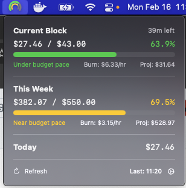

# CCUsageBar

macOS menu bar app that tracks Claude Code API usage and spend in real time.



## Features

- **Dual-ring gauge** in the menu bar — outer ring = current 5h block, inner ring = weekly spend
- **Pace-based coloring** — green/yellow/orange/red based on spend rate vs time elapsed (not just raw %)
- **Dropdown** with block, weekly, and daily cost breakdowns, burn rates, and projections
- **Notifications** at configurable thresholds (50%, 75%, 90%)
- **Settings** — block/weekly limits, refresh interval, launch at login
- Reads directly from `~/.claude/projects/**/**.jsonl` — no API keys needed

## How it works

1. `JSONLReader` scans all JSONL conversation files under `~/.claude/projects/`
2. `CostCalculator` prices each request using per-model token rates (Opus, Sonnet, Haiku)
3. `BlockCalculator` groups requests into 5h blocks (separated by 5h gaps) and computes burn rate, projection, and weekly cost (billing week: Wed 09:00 UTC)
4. `UsageService` polls on a configurable interval and feeds the views

## Build & Run

```bash
pkill CCUsageBar; ./Scripts/bundle.sh && codesign -s - --force ./build/CCUsageBar.app && open ./build/CCUsageBar.app
```

Requires macOS 14+, Swift 5.9+.

## Project Structure

```
Sources/CCUsageBar/
  CCUsageBarApp.swift          # App entry, menu bar scene
  Models/
    UsageModels.swift          # Block, Projection, BurnRate, UsageData
    AppSettings.swift          # RefreshInterval enum
  Services/
    JSONLReader.swift          # JSONL file scanner & parser
    CostCalculator.swift       # Per-model token pricing
    BlockCalculator.swift      # Block detection, weekly/daily aggregation
    UsageService.swift         # Polling + state management
    NotificationService.swift  # Threshold notifications
  Views/
    MenuBarIcon.swift          # Dual-ring gauge (NSImage)
    UsagePopoverView.swift     # Dropdown container
    BlockUsageView.swift       # Current block section
    WeeklyUsageView.swift      # Weekly section
    DailyUsageView.swift       # Daily section
    ProgressBarView.swift      # Reusable bar + pace color/label helpers
    SettingsView.swift         # Preferences window
  Utilities/
    Formatters.swift           # Currency, percentage, time formatting
    ShellExecutor.swift        # Shell helper (unused, kept for future)
```
