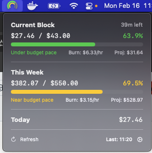

# CCUsageBar

macOS menu bar app that shows your real Claude Code rate-limit utilization (5-hour + weekly) in real time.



## Features

- **Dual-ring gauge** in the menu bar — outer ring = current 5h window, inner ring = weekly
- **Pace-based coloring** — green/yellow/orange/red based on usage vs time elapsed (not just raw %)
- **Dropdown** with 5-hour and weekly utilization, reset countdowns, and pace
- **Notifications** at configurable thresholds (50%, 75%, 90%)
- **Settings** — refresh interval, launch at login
- No API keys, no keychain token — rides Claude Code's own authenticated session

## How it works

The real 5h/7d utilization (the numbers behind `/usage`) is only exposed through the
`rate_limits` block Claude Code injects into your **status line** command on stdin. The app
never calls the API or touches your OAuth token — which would race the CLI's token refresh.

1. `Scripts/statusline-usage.sh`, called from your status line, extracts `rate_limits` and writes `~/.claude/usage-status.json`
2. `UsageService` reads that file on a file-watch (plus a polling interval) and feeds the views

> `rate_limits` only appears for Pro/Max subscribers, after the first API response in an active
> session — so utilization populates once you've used Claude Code in the current window.

## Setup

Requires `jq`. `Scripts/statusline-usage.sh` takes Claude Code's status line payload (as `$1`
or on stdin), writes `~/.claude/usage-status.json`, and exits silently when there's no
`rate_limits` block — so it's safe to call unconditionally.

**If you already have a status line script**, include it near the top, after you've captured the payload:

```bash
input=$(cat)
/path/to/ccusagebar/Scripts/statusline-usage.sh "$input"   # writes the usage file
# ... your own status line rendering using "$input" below ...
```

`input` is passed as an argument, so the script doesn't consume your stdin — your existing
rendering keeps working untouched.

**If you don't have one yet**, point Claude Code straight at the script via `~/.claude/settings.json`
(it prints nothing, so your status line stays empty — or write your own wrapper as above):

```json
{
  "statusLine": {
    "type": "command",
    "command": "/path/to/ccusagebar/Scripts/statusline-usage.sh"
  }
}
```

## Build & Run

```bash
pkill CCUsageBar; ./Scripts/bundle.sh && codesign -s - --force ./build/CCUsageBar.app && open ./build/CCUsageBar.app
```

Requires macOS 14+, Swift 5.9+.

## Project Structure

```
Scripts/
  statusline-usage.sh          # Status line producer -> ~/.claude/usage-status.json
Sources/CCUsageBar/
  CCUsageBarApp.swift          # App entry, menu bar scene
  Models/
    UsageModels.swift          # RateLimitResponse, WindowUtilization, UsageData
    AppSettings.swift          # RefreshInterval enum
  Services/
    UsageStatusReader.swift    # Reads ~/.claude/usage-status.json
    UsageService.swift         # File-watch + polling + state management
    NotificationService.swift  # Threshold notifications
  Views/
    MenuBarIcon.swift          # Dual-ring gauge (NSImage)
    UsagePopoverView.swift     # Dropdown container
    BlockUsageView.swift       # Current 5-hour window section
    WeeklyUsageView.swift      # Weekly section
    ProgressBarView.swift      # Reusable bar + pace color/label helpers
    SettingsView.swift         # Preferences window
  Utilities/
    Formatters.swift           # Percentage / time formatting
```
